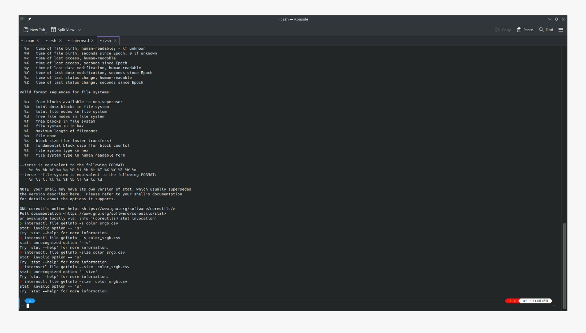
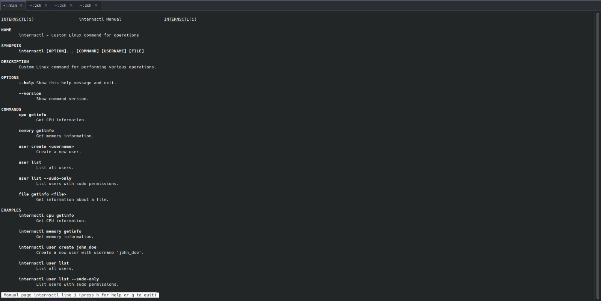
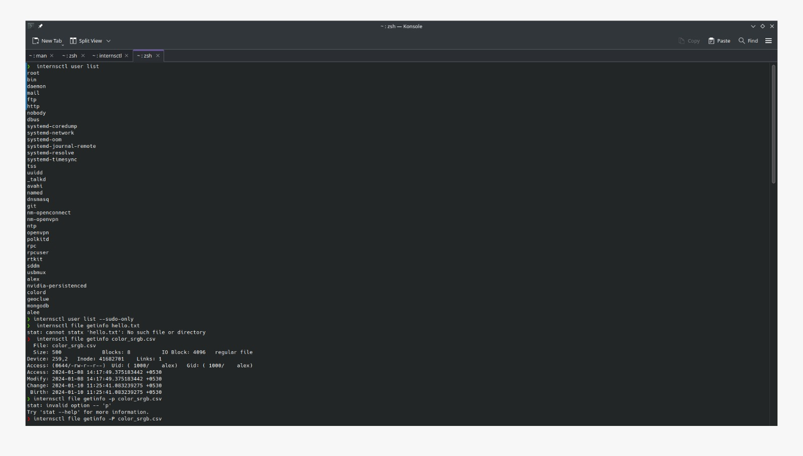
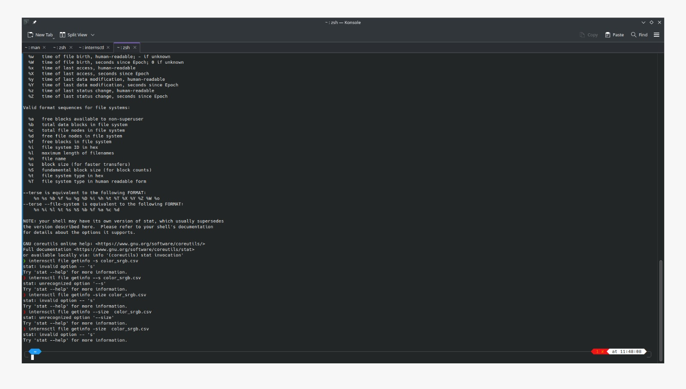
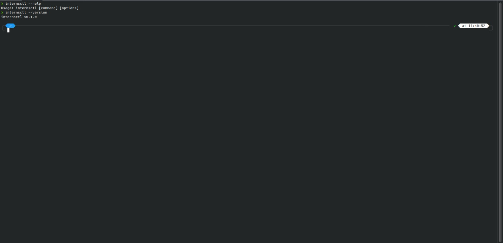
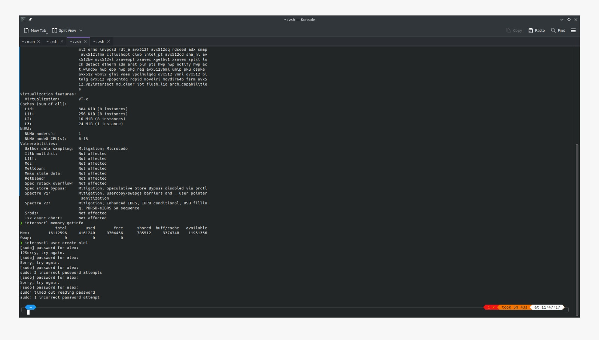
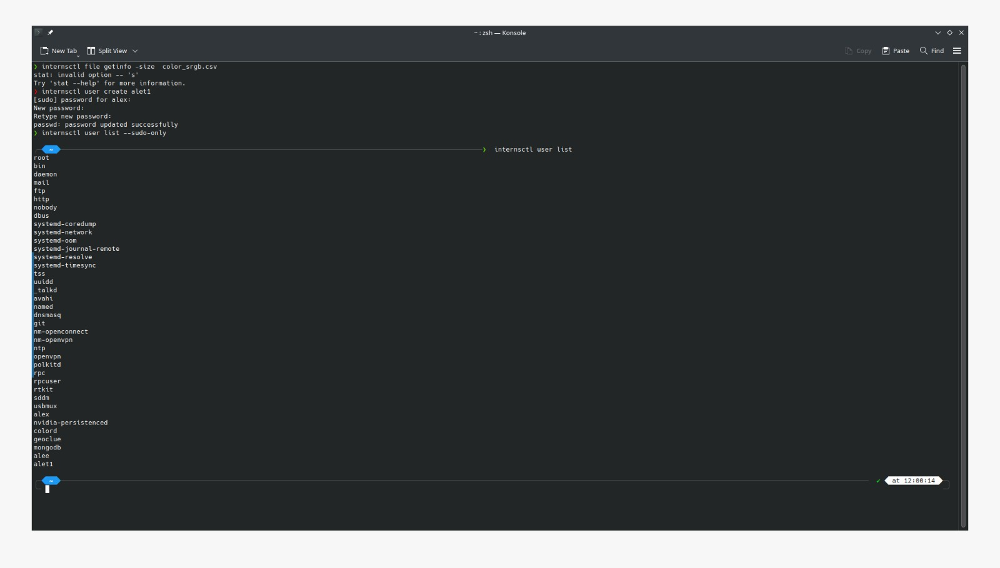

## internsctl - Custom Linux Command

### Overview
The `internsctl` script is a custom Linux command designed for performing various operations related to CPU, memory, users, and files.

### Usage


### Sections
#### Section A
- **man:** Displays manual information about the `internsctl` command, including its name, synopsis, description, options, and available commands.

#### Options
- **--help:** Displays a brief usage message.
- **--version:** Displays the version of the `internsctl` command.

#### Commands
- **cpu getinfo:** Retrieves CPU information using `lscpu`.
- **memory getinfo:** Retrieves memory information using `free`.
- **user create \<username\>:** Creates a new user using `adduser`.
- **user list:** Lists all users, and with the option `--sudo-only`, lists users with sudo permissions.
- **file getinfo \<file\>:** Retrieves information about a file, including size, permissions, owner, and last modified timestamp.

### Examples
#### CPU Information
```bash
internsctl cpu getinfo
```

#### List Users with Sudo Permissions
```bash
internsctl user list --sudo-only
```

And many more

## Images of task performed 








#### All tasks executed successfully. 